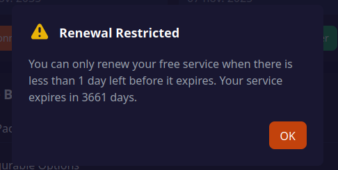

# Bot-HidenCloud Auto-Renew  +  Bypass Renewal Restricted



Ce dépôt contient un script Python (Playwright) qui automatise le renouvellement d'un service HidenCloud : ouvrir le tableau de bord, cliquer sur "Renouveler", créer la facture et, si explicitement autorisé, déclencher le paiement.

Le principe : automatiser les actions répétitives tout en gardant la décision finale (paiement) sous contrôle humain.

## Sommaire
- Prérequis
- Installation (Linux / Windows)
- Configuration
- Options (CLI)
- Exemples d'usage
- Logs et diagnostic
- Sécurité
- Déploiement CI / service
- FAQ

---

## Prérequis

- Python 3.10+
- Playwright Python et ses navigateurs (Chromium)
- Dépendances listées dans `requirements.txt`

## Installation

### Linux (Ubuntu / Debian)

```bash
python3 -m venv .venv
source .venv/bin/activate
python -m pip install --upgrade pip
pip install -r requirements.txt
python -m playwright install --with-deps
```

Sur certaines images serveur il peut être nécessaire d'installer des paquets système pour Chromium (ex: libnss3, libatk1.0-0, libxss1, libasound2).

### Windows
Installer Python [ici](https://www.python.org/downloads/) si ce n’est pas déjà fait.

```powershell
python -m pip install --upgrade pip
pip install -r requirements.txt
python -m playwright install
```

## Configuration (`config.json`)

Exemple minimal :

```json
{
	"service_manage_url": "https://panel.hidencloud.example/manage",
	"base_url": "https://panel.hidencloud.example",
	"cookies": {
		"session": "PASTE_YOUR_COOKIE"
	},
	"discord_webhook": "https://discordapp.com/api/webhooks/..."
}
```

- `service_manage_url` : URL de la page de gestion (obligatoire).
- `base_url` : utile pour dériver le domaine des cookies.
- `cookies` : mapping name → value (optionnel) — utile pour réutiliser une session validée manuellement.
- `discord_webhook` : webhook Discord pour notifications et captures (optionnel).
- `selectors` : (optionnel) remplacer les sélecteurs par défaut pour `renew`, `create_invoice`, `pay`.

## Options (ligne de commande)

- `--run-renew` : exécute la séquence (clics). Sans ce flag le script charge la page et exporte les cookies.
- `--confirm-pay` : autorise le clic final "Payer" si le montant détecté est > 0.
- `--headful` : lance le navigateur en mode visible (utile pour intervention manuelle).
- `--bypass-restriction` : continue malgré une détection "Renewal Restricted".
- `--timeout-ms <ms>` : timeout de navigation (défaut 60000).
- `--screen` : prend des captures à chaque étape et les envoie au webhook (si configuré).
- `--debug` : pause interactive avant chaque étape (utile combiné à `--headful`).

## Comportement et sécurité

- Les cookies de `config.json` sont injectés automatiquement dans le navigateur (par défaut).
- Le paiement n'est fait que si `--run-renew` est fourni ; si un montant > 0 est détecté il faut aussi `--confirm-pay`.
- `--bypass-restriction` et `--confirm-pay` peuvent déclencher des actions irréversibles — n'utilisez-les que si vous maîtrisez le flux.

## Détails techniques

- Extraction du montant : le script tente d'abord de lire la zone structurée contenant "Sous-total / Total" (cas typique des factures). En cas d'échec il applique des heuristiques globales.
- Captures : les images sont prises en full page (pour éviter les zones tronquées). Le script filtre l'envoi des images pour éviter les doublons envoyés plusieurs fois en peu de temps.

## Exemples d'utilisation

- Charger la page et exporter les cookies :

```bash
python3 renew_hidencloud_playwright.py
```

- Lancer la séquence avec intervention manuelle et captures :

```bash
python3 renew_hidencloud_playwright.py --run-renew --headful --debug --screen
```

- Lancer automatiquement et autoriser le paiement :

```bash
python3 renew_hidencloud_playwright.py --run-renew --confirm-pay --bypass-restriction
```

## Logs et diagnostic

- Le script écrit sur stdout et dans le fichier `paths.log_file` si configuré.
- Normalement, il n’y a pas de challenge Cloudflare ou Turnstile. Si vous êtes bloqué, vérifiez les cookies dans `config.json`.

## Déploiement CI / service

- Exemple GitHub Actions : écrire `config.json` depuis un secret `CONFIG_JSON`, définir `DISCORD_WEBHOOK`, installer Playwright et exécuter le script.

## FAQ rapide

Q: Le script clique sur le mauvais élément ou n'en trouve pas — que faire ?
A: Passez en `--headful`, inspectez le DOM, puis mettez à jour `selectors` dans `config.json`.

Q: Les images envoyées sur Discord sont tronquées ou envoyées en double.
A: Les captures sont maintenant en `full_page` et le script filtre les doublons envoyés sur une courte fenêtre (30s). Si vous voyez encore des doublons, vérifiez les appels multiples à `--screen` dans votre runner/cron.

## Besoin d'aide / contributions

Si vous souhaitez :
- n'envoyer que les captures finales
- uploader les captures vers un stockage (S3/GCS)
- confirmation via Discord
- autre idée

Ouvrez une issue ou indiquez la modification souhaitée, je peux l’ajouter.

---

Merci d'utiliser ce script; utilisez avec prudence.


